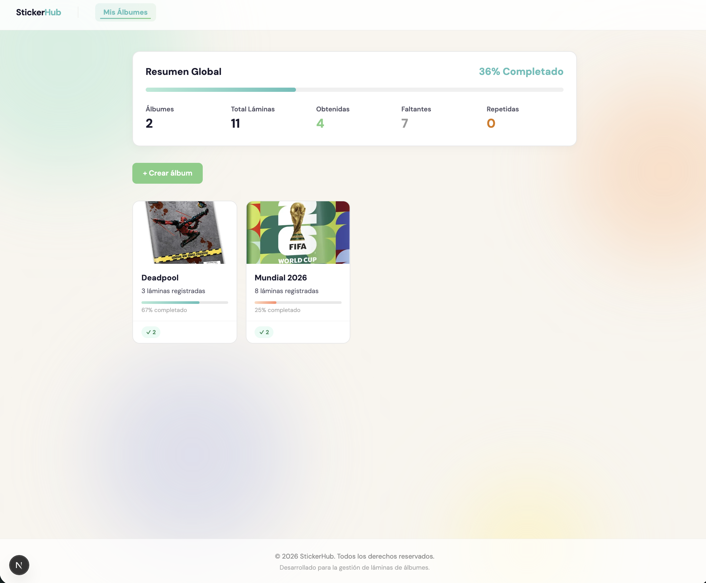
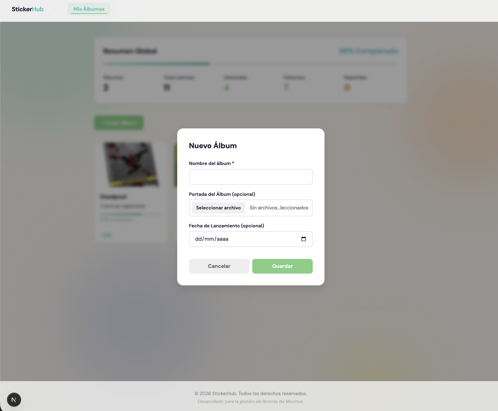
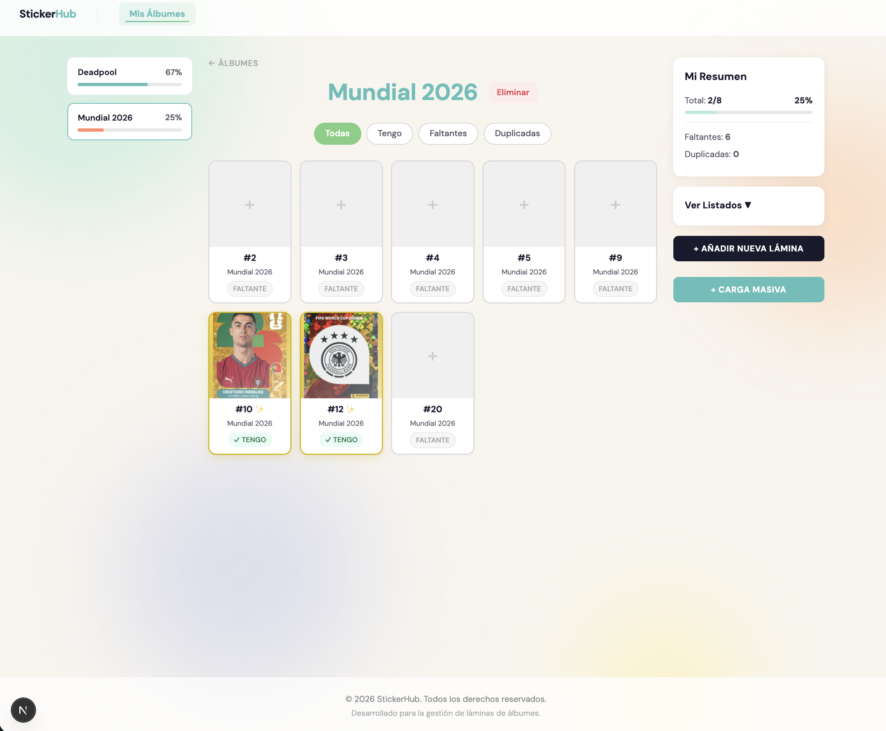
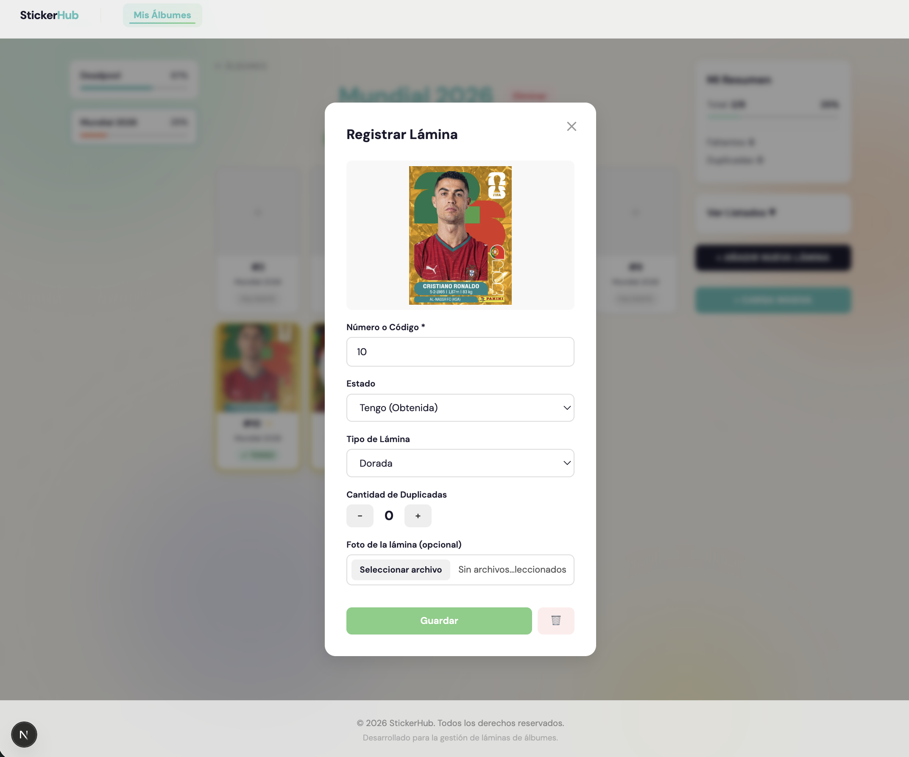
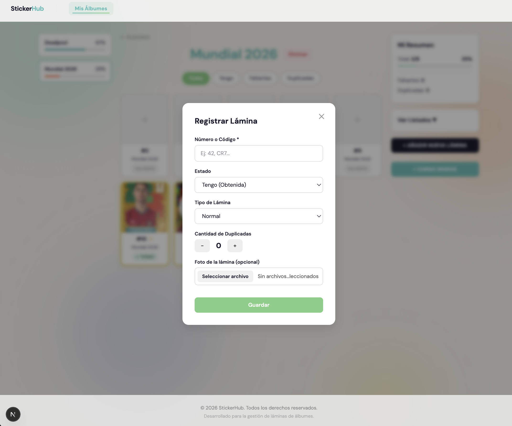
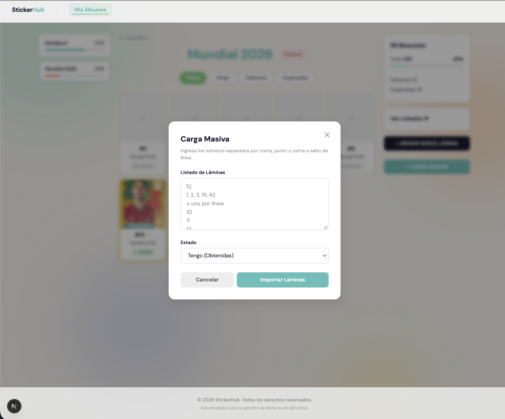

# 🎴 StickerHub

StickerHub es una aplicación web full-stack diseñada para coleccionistas. Permite crear álbumes digitales, hacer un seguimiento de tu colección, identificar láminas faltantes y llevar el conteo exacto de tus láminas repetidas.

## 📸 Capturas de Pantalla

<div align="center">
  
  <br/><em>Dashboard de Inicio con el resumen global de álbumes</em><br/><br/>
  
  
  <br/><em>Vista del álbum con listado de láminas, faltantes y repetidas</em><br/><br/>
  
  
  <br/><em>Diseño y efectos visuales de láminas Doradas y Holográficas</em><br/><br/>
  
  
  <br/><em>Modal interactivo para registrar y editar cada lámina individual</em><br/><br/>
  
  
  <br/><em>Herramienta de Carga Masiva (Bulk Import)</em><br/><br/>

  
  <br/><em>Documentación oficial de la API usando Swagger/OpenAPI</em><br/><br/>
</div>

## ✨ Funcionalidades Principales

- **Gestión de Álbumes:** Crea álbumes personalizados con metadata (portada, temática, fecha de lanzamiento).
- **Dashboard Global:** Resumen en tiempo real del progreso de tu colección, total de láminas, obtenidas, faltantes y repetidas.
- **Control Detallado de Láminas:**
  - Registra el estado exacto: _Tengo_ (con contador interactivo de duplicadas) o _Faltante_.
  - **Tipos y Efectos Visuales CSS:**
    - ✨ _Doradas:_ Brillo estático y resplandor amarillo.
    - 🌟 _Holográficas:_ Animación iridiscente continua sobre la carta.
    - ⚪ _Faltantes:_ Escala de grises con opacidad reducida.
  - Sube fotos reales de tus láminas a nivel local.
- **Carga Masiva (Bulk Import):** Importa decenas de láminas al mismo tiempo pegando listas de números, acelerando la creación inicial.
- **Exportación de Listados:** Genera instantáneamente textos limpios de tus "Faltantes" y "Repetidas" listos para copiar y compartir en intercambios.

## 🛠️ Stack Tecnológico

- **Frontend:** Next.js 16 (App Router), React, Tailwind CSS (Custom Design System inspirado en estilo "pastel/Panini").
- **Backend:** Next.js Route Handlers (API REST).
- **Base de Datos:** MySQL 8.
- **ORM:** Prisma.
- **Infraestructura:** Docker y Docker Compose.

---

## 🚀 Instalación y Uso (Con Docker)

El proyecto está 100% contenerizado. Solo necesitas tener **Docker** instalado en tu computadora.

### 1. Levantar la Base de Datos

Asegúrate de tener Docker instalado e inicia el contenedor de MySQL:

```bash
docker compose up -d
```

### 2. Instalar y Levantar la Aplicación

En tu terminal, sincroniza la base de datos e inicia el servidor de desarrollo local:

```bash
npm install
npx prisma db push
npm run dev
```

### 3. Usar la aplicación

Abre tu navegador en:
👉 **http://localhost:3000**

_(Para detener el proyecto, ejecuta `docker compose down`)_

---

## 📚 Documentación de API (Swagger)

El proyecto incluye documentación estática generada con **OpenAPI 3.0**.

1. Abre la ruta en tu navegador:
   👉 `http://localhost:3000/api-docs`
2. El archivo base se encuentra en `docs/openapi.yaml`, el cual puedes importar en **Postman** o **Swagger Editor** para realizar pruebas automatizadas.
